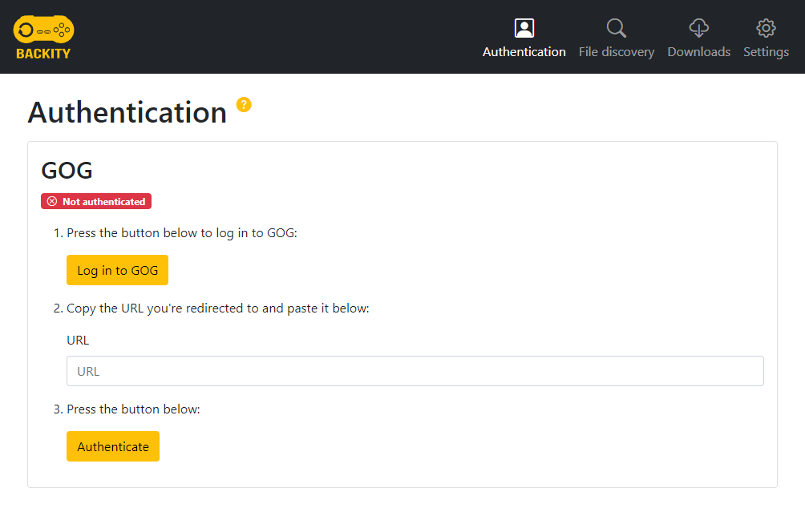

# Dev Info

* Some games return empty arrays instead of objects from the GOG API, e.g., #1207667173

# Support planned for the future

* Itch.io
* Humble Store
* IndieGala
* GamersGate
* Zoom Platform
* Steam?

# TODO

* Add all the missing tests
* Store refresh token in cookie
* Consider a better package structure
* Improve file download code (`FileDownloader`, `GogEmbedClient::getFileBuffer`)
  * Add some way to track download progress (https://stackoverflow.com/questions/68518804/how-to-track-progress-of-databufferutils-write)
  * Improve the way file-size checks are handled (e.g., free space verification)
  * Try to remove the need to save to a temp file before renaming
  * Try to add tracking of download speed
  * Try to add pausing/resuming of downloads
* Auto-save cd-keys
* Generify file discovery/downloading code to support more than just GOG in the future
* Support downloading extras
* Add loading icons to everything on the frontend

----------------------------------------------------------------------------

# Backity


[](https://sonarcloud.io/dashboard?id=little-pinecone_backity)
[](https://sonarcloud.io/dashboard?id=little-pinecone_backity)
[](https://sonarcloud.io/dashboard?id=little-pinecone_backity)

[](https://sonarcloud.io/dashboard?id=little-pinecone_backity)
[](https://sonarcloud.io/dashboard?id=little-pinecone_backity)
[](https://sonarcloud.io/dashboard?id=little-pinecone_backity)
[](https://sonarcloud.io/dashboard?id=little-pinecone_backity)
[](https://sonarcloud.io/dashboard?id=little-pinecone_backity)


To learn how to set up a project like this one, check out the [Integrate Angular with a Spring Boot project](http://keepgrowing.in/java/springboot/integrate-angular-with-a-spring-boot-project/)
post.

This project is a multi-module application, using the following frameworks: Spring Boot for the backend and Angular for
the frontend. The project can be built into a single jar file using Maven.

- [Getting Started](#getting-started)
- [Profiles summary](#profiles-summary)
  * [Spring profiles](#spring-profiles)
  * [Maven profiles](#maven-profiles)
- [API documentation](#api-documentation)
  * [Swagger](#swagger)
  * [OpenAPI](#openapi)
- [Client code generation](#client-code-generation)
- [Working with frontend on a local environment](#working-with-frontend-on-a-local-environment)
- [Running test suits](#running-test-suits)
  * [Backend](#backend)
  * [Frontend](#frontend)
- [SonarQube analysis on a local environment](#sonarqube-analysis-on-local-a-environment)
  * [Prerequisites](#prerequisites)
  * [Full analysis](#full-analysis)
  * [Backend analysis](#backend-analysis)
  * [Frontend analysis](#frontend-analysis)
  * [Verifying results](#verifying-results)
- [Built With](#built-with)

## Getting Started

First, [clone](https://docs.github.com/en/github/creating-cloning-and-archiving-repositories/cloning-a-repository-from-github/cloning-a-repository)
this repository.

Then, build it locally with:

```shell
mvn clean install
```

You can run the project from command line with:

```shell
mvn spring-boot:run
```

As a result, you should be able to visit the home page on [http://localhost:8080/](http://localhost:8080/):



## Profiles summary

The project can be built with various different profiles to allow for flexible configuration. Below you'll find a short
summary of the available profiles.

### Spring profiles

* `dev` - for allowing request from `http://localhost:4200/`. This profile is set as an active profile by default. 
  You can change it in the `backend/src/main/resources/application.properties` file.

### Maven profiles

* `sonar-cloud` - for code analysis on push to `master`
* `code-coverage` - for including code coverage reports from the `backend` module during a sonar analysis
* `frontend-pre-sonar` - for including code coverage reports from the `frontend` module during a sonar analysis
* `frontend-sonar` - for running only a sonar analysis for the `frontend module`
* `angular` - for [generating client code](https://codesoapbox.dev/generate-client-code-from-spring-boot-using-maven/)

## API documentation

The backend module serves one endpoint for testing purposes. First, build and run the application. Then you'll be able
to reach the API docs.

### Swagger

The Swagger UI page: [http://localhost:8080/swagger-ui.html](http://localhost:8080/swagger-ui.html).

### OpenAPI

The OpenAPI description in json format is available at the following
url: [http://localhost:8080/v3/api-docs](http://localhost:8080/v3/api-docs).

## Client code generation

To run [client code generation](https://codesoapbox.dev/generate-client-code-from-spring-boot-using-maven/) 
using the `openapi-generator-maven-plugin` execute the following command:

```shell
mvn clean verify -Pangular -DskipTests
```

The application will be started so that the API specification can be obtained from the open api endpoint.

The generated code is available in the `frontend/src/main/angular/src/backend` directory. Don't edit those files manually.

## Working with frontend on a local environment

If you want to see how changes you make in the frontend code affects the application you don't need to build it together
with the `backend` module every time. Use the following commands:

```shell
cd frontend/src/main/angular
ng serve
```

and visit [http://localhost:4200/](http://localhost:4200/). The application reloads automatically which speeds up your work.

In order to incorporate changes with the project, rebuild the whole application from the main project directory with:

```shell
mvn clean install
```

## Running test suits

### Backend

Run unit tests with the following command in the project directory:

```shell
mvn test
```

Run all tests with the following command in the project directory:

```shell
mvn verify
```

### Frontend

Run all tests for the Angular code with:

```
cd frontend/src/main/angular
ng test
```

## SonarQube analysis on a local environment

### Prerequisites

* Read the [Boost project quality with SonarQube – local code analysis](https://keepgrowing.in/tools/boost-project-quality-with-sonarqube-local-code-analysis/)
  post to set up dependencies properly.
* You'll need Chrome installed on your machine for running a frontend analysis with code coverage.
* Read the [How to add an Angular module built with Maven to a SonarQube analysis](https://keepgrowing.in/angular/how-to-add-an-angular-module-built-with-maven-to-a-sonarqube-analysis/) 
to learn more about analysing a multi-module maven application.
  

### Full analysis

You can run analysis for the **whole project** (both backend and frontend):

```shell
mvn clean verify sonar:sonar -Pfrontend-pre-sonar -Pcode-coverage -Dsonar.login=your_username -Dsonar.password=your_password
```

Or use the shell script: `./run-sonar.sh -a`

### Backend analysis

You can run analysis for the **backend** module:

```shell
cd backend
mvn clean verify sonar:sonar -Pcode-coverage -Dsonar.login=your_username -Dsonar.password=your_password
```

### Frontend analysis

You can run analysis for the **frontend** module:

```shell
cd frontend
mvn sonar:sonar -Pfrontend-pre-sonar -Dsonar.login=your_username -Dsonar.password=your_password
```

Or use the shell script which you can find in the closing paragraphs of
the [How to add an Angular module built with Maven to a SonarQube analysis](https://keepgrowing.in/angular/how-to-add-an-angular-module-built-with-maven-to-a-sonarqube-analysis/)
post.

### Verifying results

Visit the [Projects](http://localhost:9000/projects) page and choose the right project. Depending on which modules were
analysed you can see one, two, or three projects.

## Built With

* [Maven](https://maven.apache.org/)
* [Spring Boot v2.5+](https://start.spring.io/)
* [Angular v12+](https://angular.io/)
* [frontend-maven-plugin](https://github.com/eirslett/frontend-maven-plugin)
* [springdoc-openapi](https://springdoc.org/)
* [Bootstrap v5+](https://getbootstrap.com/docs/5.0/getting-started/introduction/)
* [ng-bootstrap](https://ng-bootstrap.github.io/#/home)

<small><i><a href='http://ecotrust-canada.github.io/markdown-toc/'>Table of contents generated with markdown-toc</a></i></small>
