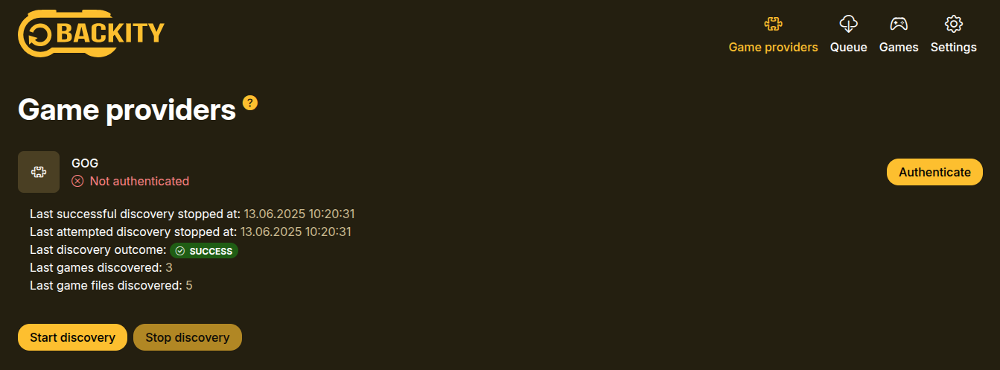

[](https://codesoapbox.dev/)

<div align="center">

# Backity


[](https://sonarcloud.io/dashboard?id=backity)
[](https://sonarcloud.io/dashboard?id=backity)
[](https://sonarcloud.io/dashboard?id=backity)

[](https://sonarcloud.io/dashboard?id=backity)
[](https://sonarcloud.io/dashboard?id=backity)
[](https://sonarcloud.io/dashboard?id=backity)
[](https://sonarcloud.io/dashboard?id=backity)
[](https://sonarcloud.io/dashboard?id=backity)


</div>

Backity is a web service for automatically downloading backups of your games from external clients such as GOG.

**For instructions on how to use Backity, [consult the Wiki](https://github.com/daniel-frak/backity/wiki).**

**⚠️Warning: Backity is not yet production-ready! Anything may break at any time.⚠️**

The information below is aimed at developers who want to extend this project's functionality.

---

- [Getting Started](#getting-started)

## Getting Started

First, [clone](https://docs.github.com/en/github/creating-cloning-and-archiving-repositories/cloning-a-repository-from-github/cloning-a-repository)
this repository.

Then, build it locally with:

```shell
mvn clean install
```

You can run the project with the following command:

```shell
mvn spring-boot:run -Dspring-boot.run.profiles=dev
```

As a result, you should be able to visit the home page on [http://localhost:8080/](http://localhost:8080/):



<small><i><a href='http://ecotrust-canada.github.io/markdown-toc/'>Table of contents generated with
markdown-toc</a></i></small>
