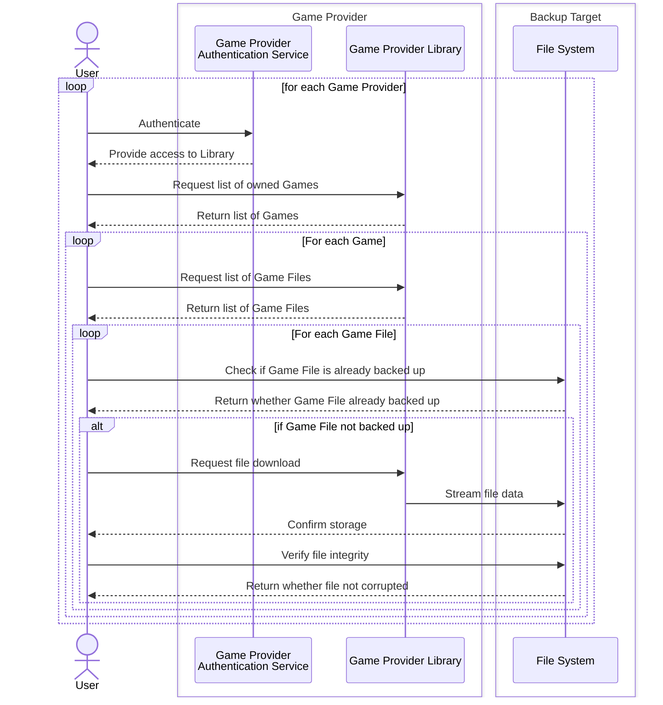
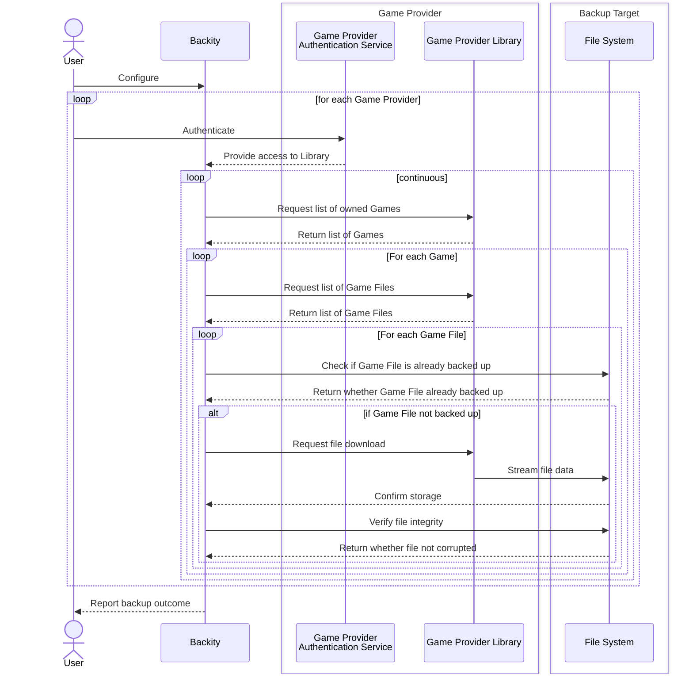

The following diagram illustrates the tedious manual process that users typically face when trying to preserve their
game libraries:

This workflow includes several pain points:
- Manual tracking of already backed-up files
- Time-consuming file-by-file verification
- No automation of recurring tasks

Backity can transform this manual process into an automated workflow:

At the same time, if complete automation is not desired, the user can manually choose which games or files they want
backed up. The process then continues automatically.