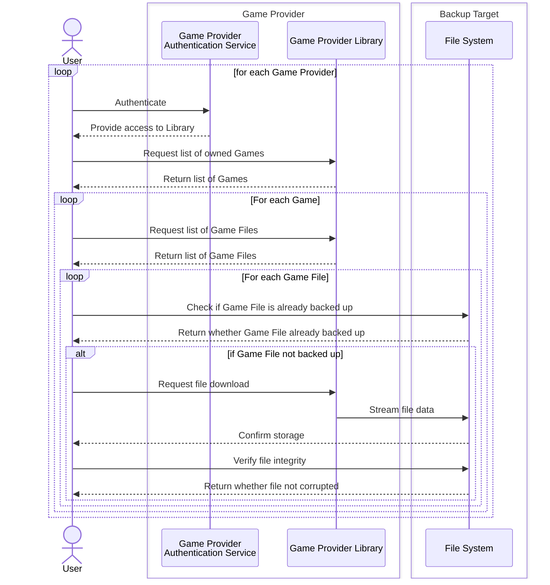
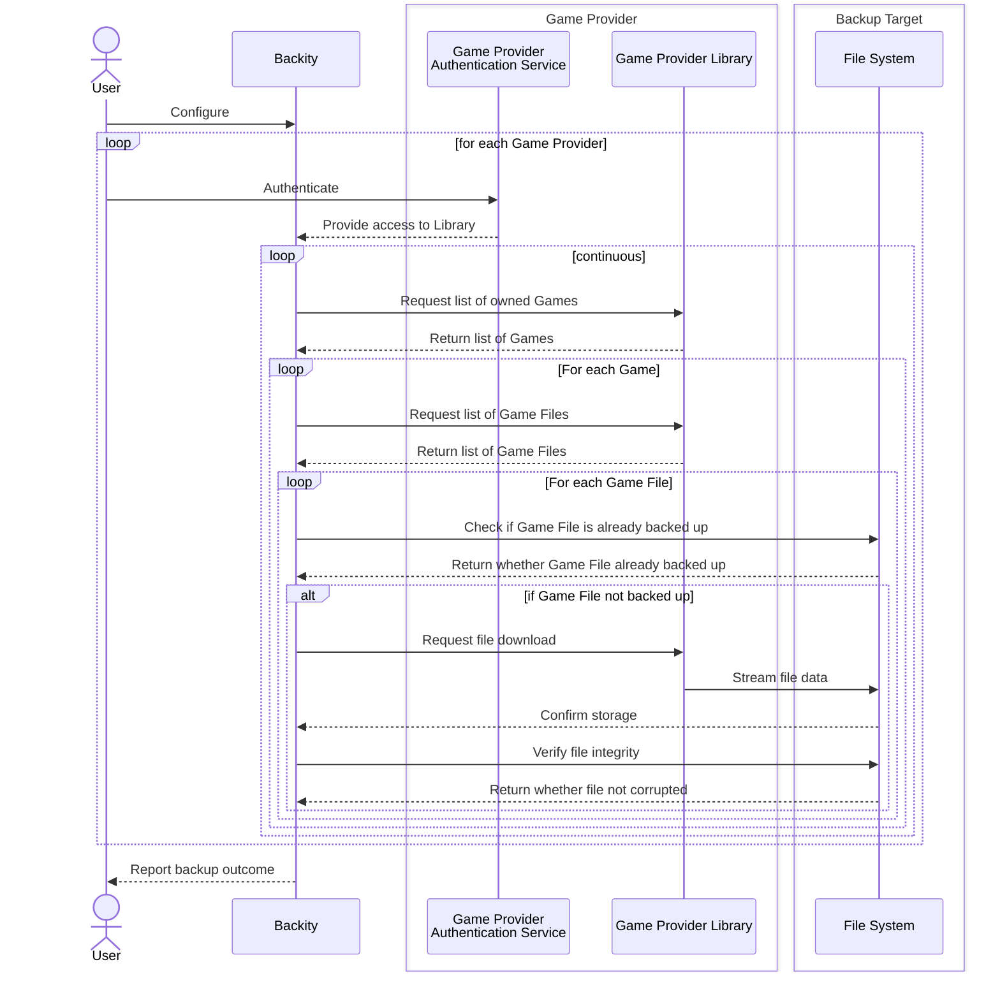

{: .important }
This document is a work in progress.

The domain centers around automated preservation of digital game libraries. Its core elements are:

- **Game Providers**: Sources of games and their files,
- **Games**: Digital products containing downloadable files,
- **Game Files**: Actual content that needs to be preserved,
- **Backup Target / File System**: Storage system maintaining preserved files.

The model ensures reliable automation of the preservation process while maintaining clear traceability
between provider files and their backups.
It must be flexible enough to accommodate various Game Providers and Backup Targets (or File Systems).
Unique authentication mechanisms should be supported for every Game Provider.
Game Files should be directly connected to their Games, and their backup status should be clearly represented.

A standard workflow for backing up game files is quite tedious and, at a high level, looks something like this:

Backity automates a lot of the busywork, only requiring the user to authenticate with the Game Providers,
while the backups are done continuously in the background:

